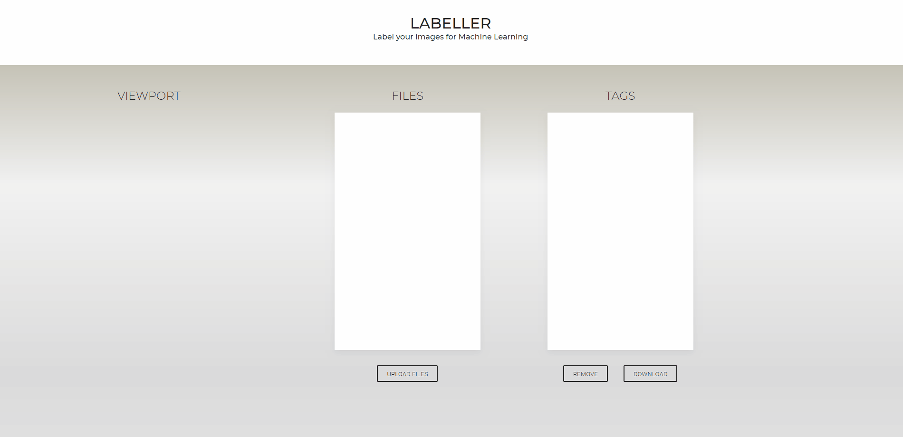

# Labeller

Label your images for Machine Learning.

## Description

An easy to use, minimalistic interface for manual Image Annotation. Labeller is a browser-based image annotation platform where users can upload, annotate, and share images online.

## Usage

In order to use it, visit the demo page [here](https://jsgilberto.github.io/labeller/), and follow the next steps:

1. Upload the images you want to tag by pressing the Upload Files button.
2. Select any of the uploaded files.
3. Start tagging in the Viewport by holding down your left click button and dragging your mouse.
4. You can make as many tags you want per image.
5. Once you finish tagging your image, click on the Download button to download the XML file.

## Dependencies

This project was entirely done in the browser, no dependencies needed.

## Live Version

Visit the live version [here](https://jsgilberto.github.io/labeller/)